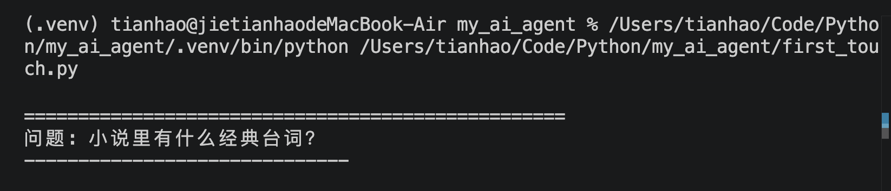
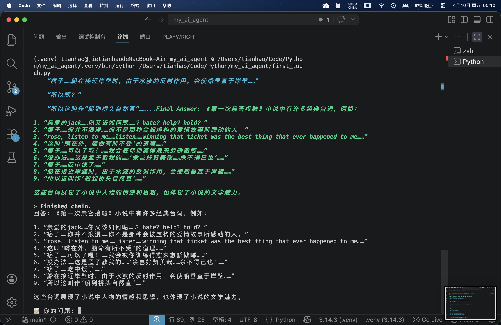
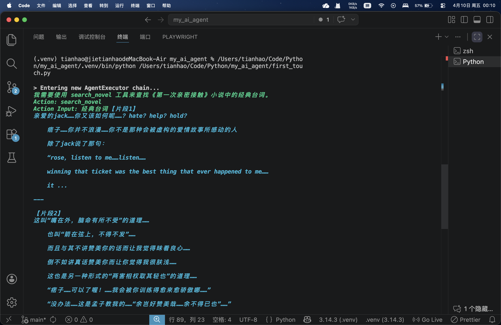

# 📖 《第一次亲密接触》RAG 问答智能体

基于 RAG（检索增强生成）技术开发的小说问答系统。用户输入任意关于《第一次亲密接触》的问题，系统会先从小说原文中检索相关内容，再基于检索结果生成准确答案，有效避免大模型“幻觉”问题。

---

## ✨ 功能特点

- 🔍 **语义检索**：不是关键词匹配，而是理解问题含义去小说里找相关内容
- 🧠 **AI 智能体**：基于 LangChain ReAct Agent，能自主决定调用检索工具还是计算器
- 📚 **本地向量库**：使用 BAAI/bge-small-zh 模型将小说向量化，检索速度快且免费
- 💬 **交互式问答**：支持连续对话，像 ChatGPT 一样使用

---

## 📸 效果展示


*提问界面*<br>


*回答效果*<br>


*Agent 思考过程（verbose 模式）*

---

## 🛠️ 技术栈

| 技术 | 用途 |
|------|------|
| **LangChain** | Agent 框架、工具定义、ReAct 推理循环 |
| **通义千问 (qwen-turbo)** | 大语言模型，基于检索结果生成答案 |
| **BAAI/bge-small-zh** | 中文向量化模型，将文本转为向量（本地运行） |
| **FAISS** | 向量数据库，存储和检索文本向量 |
| **Python-dotenv** | 环境变量管理（API Key 等） |

---

## 🚀 快速开始

### 1. 克隆仓库

```bash
git clone https://github.com/Suill114/novel-rag-agent.git
cd novel-rag-agent
